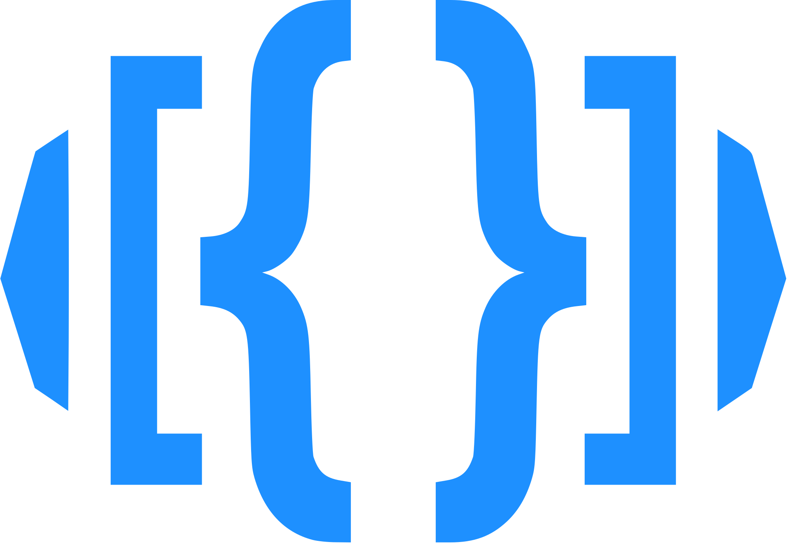

<div class="display: flex;">
  
  <h1>MTGJSON Website</h1>
</div>

[](https://shields.io/)
[](https://GitHub.com/ericlakatos/windfish-app/graphs/commit-activity)
[](https://github.com/ericlakatos/windfish-app/blob/master/LICENSE.md)

## Dependencies
- [Node](https://www.nodejs.com)
  - You can directly download Node but if you are able to use [Brew](https://brew.sh/) then you can quickly switch between Node version using the `n` package that Brew provides.
- [VuePress](https://www.vuepress.com)
  - Vuepress is a static site generator that uses API's and Markdown.
- `yarn` or `npm`
  - `yarn` is a wrapper around `npm` (We will be deprecating normal operations of `yarn` soon).
  - `npm` automatically comes installed with Node.

## Installation

Install Vuepress globally.

```
yarn global add vuepress # OR npm install -g vuepress
```

Install project dependencies (inside the repository).

```
yarn install # OR npm install
```

## Developing

```
yarn dev # OR npm run dev
```

## Linting

```
yarn test # OR npm run test
```

## Testing

Tests project using Jest tests and attempts to run a build. This command will also automatically run during Husky's pre-commit checks.

```
yarn lint # OR npm run lint
```

## Building

```
yarn build # OR npm run build
```

## Purging

Remove all packages

```
yarn purge
```

## Notes

### Landcycle

Landcycle is a JS class that allows JSON to take mustache variables such as `{{link:variable}}` (creating an internal link), `{{external:display-text$url}}` (creating an external link) and `{{code:variable}}` (creating an inline-code style) and then intercepts the JSON in Vue to hydrate the data in to data of your choosing. On the website we use this to change data structures in to anchor tags that link to other documentation while maintaining our SPA.
